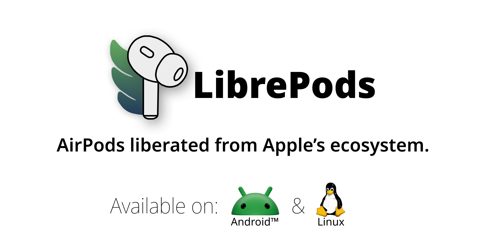

<p align="center">
  
  
  
</p>



# EveryPods

EveryPods brings useful AirPods controls to Android, including listening modes,
ear detection, battery status, gestures, and multi-device handover.

EveryPods is an independent Android project. It does not require root. Some
advanced controls depend on the Android Bluetooth stack and the AirPods model
and firmware in use.

## Supported Platform

- Android 13 (SDK 33) and newer.
- AirPods Pro 2 are the primary tested model.
- Other AirPods models may expose a smaller set of controls.

## Support

- Email: `automated.ventures.apps@gmail.com`
- Bug reports and feature requests: [GitHub Issues](https://github.com/ntsour/Everypods/issues)

Please include the Android version, AirPods model, app version, and a short
description of the problem. Do not post private logs, Bluetooth addresses, or
API keys in public issues.

## Building

Requirements: Android Studio or a Java 21 environment, Android SDK 37, and NDK
30.0.14904198.

```sh
cd android
./gradlew :app:assembleDebug
./gradlew :app:testDebugUnitTest
```

For a Google Play bundle, configure the local release signing properties and
run:

```sh
./gradlew :app:bundlePlayRelease
```

See [docs/versioning.md](./docs/versioning.md) for release numbering.

## Privacy and Security

See the [privacy policy](https://ntsour.github.io/Everypods/privacy/) for the
permissions and local data model. The source is also available in
[PRIVACY.md](./PRIVACY.md). See [SECURITY.md](./SECURITY.md) for private
vulnerability reporting guidance.

## License and Attribution

EveryPods is released under the GNU General Public License v3.0. See
[LICENSE](./LICENSE) and [NOTICE](./NOTICE) for project attribution and
third-party asset notices.

AirPods is a trademark of Apple Inc. EveryPods is an independent project and
is not affiliated with or endorsed by Apple.
